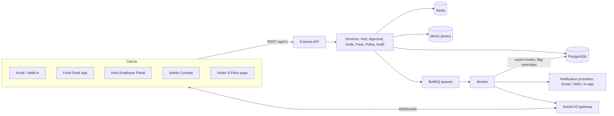
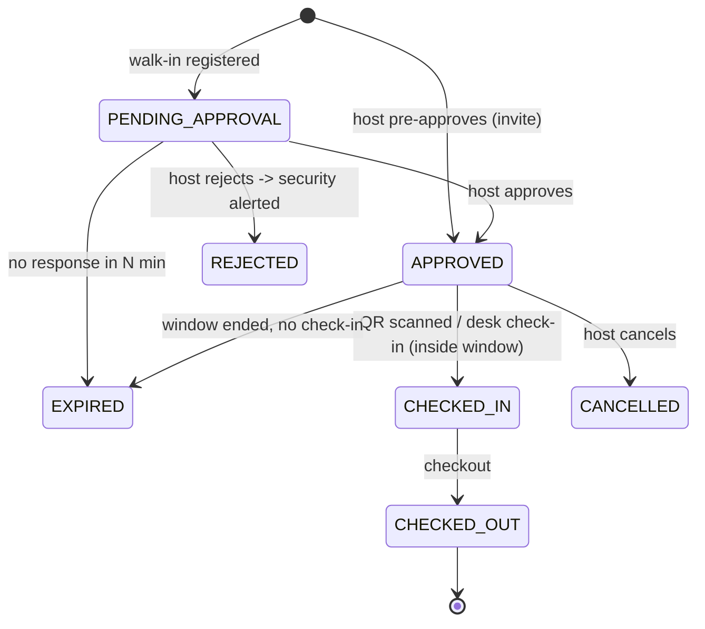

# Visitor Management System (VMS) — Architecture

## 1. Stack (opinionated, and why)

| Layer | Choice | Why it scores points |
|---|---|---|
| Frontend | React 18 + Vite + TypeScript + Tailwind + shadcn/ui + TanStack Query + React Hook Form + Zod | "Framework = plus point", typed forms, cached server state, fast UX |
| Backend | Node 20 + Express + TypeScript (modular, layered: route → controller → service → repository) | Simple to read, easy to explain in review |
| DB | PostgreSQL 16 + Prisma ORM | Relational data (visits ↔ hosts ↔ offices), indexes, transactions |
| Cache / jobs | Redis + BullMQ | O(1) rate-limit counters, delayed jobs for auto-expiry and overstay alerts |
| Real-time | Socket.IO (rooms per user + per office) | Instant host approval requests, live front-desk board |
| Files | MinIO (S3-compatible) with local-disk fallback | Visitor photos, shows cloud-ready design |
| Notifications | Provider interface → Mailpit (email), console mock (SMS), in-app | Real flow with mock data, swappable for SendGrid/Twilio |
| QR | HMAC-signed JWT in the QR + `qrcode` / `html5-qrcode` | Tamper-proof, single-use pass |
| Validation | Zod schemas shared across frontend and backend (`packages/shared`) | One source of truth, consistent error messages |
| Testing | Vitest + Supertest (API), Playwright (E2E), k6 (load) | Proves the performance and scalability claims |
| Infra | Docker Compose (postgres, redis, minio, mailpit, api, web) | One-command demo |

## 2. System diagram



## 3. Roles (RBAC)

| Role | Can do |
|---|---|
| `ADMIN` | Policies (pre-approval limit, overstay threshold, office capacity), watchlist, users, analytics, audit log |
| `HOST` (employee) | Invite / pre-approve visitors, approve or reject walk-ins, see own visit history |
| `SECURITY` (front desk) | Register walk-ins with photo, scan QR, check in / check out, see live board, handle denied visitors |
| Visitor (no login) | Open e-pass link, self check-in at kiosk via QR |

Auth: JWT access token (15 min) + httpOnly refresh cookie. Middleware `requireRole(...)`.

## 4. Data model (Prisma)

- **User**: id, name, email, phone, role, departmentId, officeId
- **Department**, **Office**: id, name, capacity
- **Visitor**: id, fullName, phone (unique), email, company, photoUrl, isWatchlisted — deduplicated by phone so returning visitors auto-fill
- **Invite** (pre-approval event): id, hostId, title, visitType, officeId, windowStart, windowEnd, note, createdAt
- **Visit**: id, visitorId, hostId, inviteId?, officeId, purpose, visitType, status, requestedAt, decidedAt, decidedById, checkInAt, checkOutAt, windowStart, windowEnd, rejectionReason, version
- **VisitPass**: id, visitId, tokenHash, expiresAt, usedAt
- **Notification**: id, userId, type, payload, readAt
- **AuditLog**: id, actorId, action, entity, entityId, before, after, at (append-only)
- **Policy**: key/value (e.g. `MAX_PREAPPROVALS_PER_HOST_PER_DAY=5`, `OVERSTAY_MINUTES=480`)

Enums: `VisitType` = BUSINESS_GUEST, VENDOR, PERSONNEL, GOVT_OFFICIAL, INTERVIEW, CONTRACT_STAFF, DELIVERY, OTHER.

### Key indexes
- `Visit(officeId, status, checkInAt)` — front-desk board
- `Visit(hostId, status)` — host inbox
- `Visit(status, windowEnd)` — expiry sweeps (backup to delayed jobs)
- GIN `pg_trgm` on `Visitor(fullName)`, plus btree on `phone`, `email` — fast fuzzy search
- `VisitPass(tokenHash)` unique

## 5. Visit state machine



`OVERSTAY` is a derived flag (checked in, not out, past window end or threshold), raised by a delayed job and pushed live to the front desk.

All transitions go through a single `transition(visit, event)` function with a whitelist table. Invalid transitions return `409 INVALID_TRANSITION`.

## 6. Core flows

1. **Walk-in**: Security fills the form and captures a webcam photo → upload to MinIO → `Visit(PENDING_APPROVAL)` → socket + email/SMS to host → host approves in one click → pass (QR) generated → front desk sees it flip live.
2. **Pre-approval (invite)**: Host creates an invite (title, type, office, date, time window, note, guests searched by name/email/phone) → policy check (Redis `INCR host:{id}:{date}` with TTL, O(1)) → Visit(APPROVED) + signed QR e-pass emailed → BullMQ delayed job at `windowEnd` to expire it.
3. **Check-in**: QR scan → verify HMAC → atomic `UPDATE ... WHERE status='APPROVED' AND now BETWEEN windowStart AND windowEnd` → single-use (`usedAt`) → CHECKED_IN → schedule overstay job.
4. **Rejection**: status REJECTED → security gets a real-time red alert with visitor photo.

## 7. Complexity and performance

| Operation | Approach | Time |
|---|---|---|
| Visitor search | trigram GIN index + limit | ~O(log n) + k |
| Front-desk list | cursor pagination on (checkInAt, id) | O(log n + page) — no OFFSET scans |
| Pre-approval limit | Redis INCR + EXPIRE | O(1) |
| Auto-expiry | BullMQ delayed job per visit | O(log n) scheduling, no full-table cron scans |
| QR validation | HMAC verify + unique index lookup | O(1) + O(log n) |
| Double check-in race | conditional UPDATE / optimistic `version` | Safe under concurrency |
| Dashboard counts | cached in Redis 30s, invalidated on transitions | O(1) reads |

Space: one row per visit plus one per pass. Photos in object storage, not the DB. Audit log is append-only and partitionable by month.

## 8. Scalability

- Stateless API → horizontal scaling behind a load balancer; Socket.IO Redis adapter for multi-instance broadcast.
- Workers scale independently from the API.
- Photos on S3/CDN.
- Read-heavy dashboards served from cache; Postgres read replicas when needed.
- Multi-office by design (`officeId` on everything), so new sites need no code changes.

## 9. Error handling and UX

- Central error middleware → `{ error: { code, message, details } }` with stable codes (`VALIDATION_ERROR`, `LIMIT_EXCEEDED`, `PASS_EXPIRED`, `INVALID_TRANSITION`, `WATCHLISTED`).
- Zod validation on both ends with inline field errors.
- Toasts on every success or failure, skeleton loaders, empty states, confirm dialogs for destructive actions.
- Idempotency key on check-in and approve so double-clicks are harmless.
- Rate limiting on public kiosk endpoints; helmet, CORS, and request IDs in logs (pino).

## 10. Repo layout

```
vms/
  apps/
    api/        # Express + Prisma + BullMQ worker
    web/        # React + Vite
  packages/
    shared/     # Zod schemas, enums, types
  docker-compose.yml
  k6/           # load tests
  docs/         # screenshots, complexity analysis, demo script
```
