# Visitor Management System (VMS)

A production-quality visitor management system: pre-approved invites with QR e-passes, walk-in
registration with host approval, a live front-desk board, a kiosk QR check-in flow, and an admin
console with analytics and an audit trail. Built end-to-end — data layer, API, background jobs,
real-time push, frontend, tests, and load/perf verification — per the spec in
[ARCHITECTURE.md](ARCHITECTURE.md) and the phase plan in
[CLAUDE_CODE_PROMPT.md](CLAUDE_CODE_PROMPT.md). Sensible calls made where the spec didn't say are
logged in [docs/decisions.md](docs/decisions.md).

## Setup (3 commands)

```bash
cp .env.example .env && pnpm install
docker compose up -d postgres redis minio mailpit && pnpm --filter=@vms/api run db:migrate:deploy
pnpm --filter=@vms/api run db:seed && pnpm dev   # api :4000, web :5173
```

Or the fully containerized demo — `docker compose up` (builds and runs api, worker, web, and
infra together). If a port in `.env` collides with something already running locally, change
that `*_PORT` variable first — every container port is read from `.env`.

## Demo credentials

Every seeded user shares the password **`Passw0rd!`**.

| Role     | Email                                         | Notes                                     |
| -------- | --------------------------------------------- | ----------------------------------------- |
| Admin    | `admin@vms.local`                             | Policies, watchlist, analytics, audit log |
| Security | `security1@vms.local` … `security3@vms.local` | One per office; front desk + kiosk        |
| Host     | `host1@vms.local` … `host25@vms.local`        | Invite, approve, check-in history         |

Kiosk (`/kiosk`) and the visitor e-pass page (`/pass/:token`) need no login, per spec.

## Feature checklist

| Requirement                          | Where                                                                      |
| ------------------------------------ | -------------------------------------------------------------------------- |
| Pre-approval invite with QR e-pass   | `POST /invites`, `pages/host/InviteVisitors.tsx`, `pages/EPass.tsx`        |
| Walk-in registration + photo capture | `POST /visits/walk-in`, `pages/desk/WalkIn.tsx` (webcam + upload fallback) |
| Host approve/reject (real-time)      | `POST /visits/:id/approve\|reject`, `pages/host/Approvals.tsx`, Socket.IO  |
| Front-desk live board + filters      | `GET /visits`, `pages/desk/Board.tsx` (cursor pagination, infinite scroll) |
| Guest detail + check-out             | `GET /visits/:id`, `pages/desk/GuestDetailsDrawer.tsx`                     |
| Kiosk QR self-check-in               | `POST /passes/verify`, `pages/Kiosk.tsx` (`html5-qrcode`)                  |
| Watchlist blocking                   | `visitorService.assertNotWatchlisted`, `pages/admin/Watchlist.tsx`         |
| RBAC (Admin/Host/Security)           | `middleware/auth.ts` (`requireAuth`, `requireRole`)                        |
| State machine + audit trail          | `domain/visitStateMachine.ts`, `AuditLog`, Guest Details timeline          |
| Auto-expiry (pending / unused pass)  | `jobs/handlers.ts` (`expire-pending`, `expire-visit`)                      |
| Overstay detection                   | `jobs/handlers.ts` (`overstay-check`) — derived flag, not a stored status  |
| Analytics dashboard                  | `GET /admin/analytics`, `pages/admin/Analytics.tsx` (Recharts)             |
| Audit log with pagination            | `GET /admin/audit`, `pages/admin/AuditLog.tsx`                             |
| Rate limiting (public/kiosk)         | `middleware/rateLimit.ts` on `/passes/*`                                   |
| Idempotent check-in/out              | `lib/idempotency.ts` (`Idempotency-Key` header, Redis-backed)              |

## Architecture

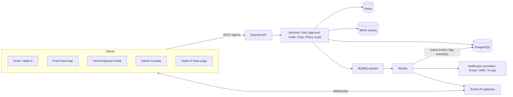

Full data model, the Visit state machine diagram, and the endpoint list are in
[ARCHITECTURE.md](ARCHITECTURE.md).

## Tech stack and why

| Layer         | Choice                                                                      | Why                                                   |
| ------------- | --------------------------------------------------------------------------- | ----------------------------------------------------- |
| Frontend      | React 18 + Vite + TS + Tailwind + TanStack Query + React Hook Form + Zod    | Typed forms, cached server state, fast dev loop       |
| Backend       | Node 20 + Express + TS, layered (route → controller → service → repository) | Simple to read and reason about                       |
| DB            | PostgreSQL 16 + Prisma                                                      | Relational data, transactions, `pg_trgm` fuzzy search |
| Cache / jobs  | Redis + BullMQ                                                              | O(1) counters, delayed jobs without cron table scans  |
| Real-time     | Socket.IO + Redis adapter/emitter                                           | Multi-process push (API and worker both emit)         |
| Files         | MinIO (S3-compatible)                                                       | Visitor photos, cloud-ready                           |
| Notifications | Email (Mailpit) / SMS (console) / in-app, one interface                     | Swappable for SendGrid/Twilio later                   |
| QR            | HMAC-signed JWT + `qrcode.react` / `html5-qrcode`                           | Tamper-proof, single-use, scannable                   |
| Testing       | Vitest + Supertest, Playwright, k6                                          | Unit/integration, real-browser E2E, load              |
| Infra         | Docker Compose                                                              | One-command demo                                      |

## API reference

All routes are under `/api/v1`. 🔒 = `requireAuth`; role in parens = `requireRole(...)`.

| Method & path                                              | Auth                | Purpose                                                             |
| ---------------------------------------------------------- | ------------------- | ------------------------------------------------------------------- |
| `POST /auth/login`                                         | —                   | Issue access token + httpOnly refresh cookie                        |
| `POST /auth/refresh`                                       | —                   | Rotate the access token from the refresh cookie                     |
| `POST /auth/logout`                                        | —                   | Clear the refresh cookie                                            |
| `POST /visitors/search?q=`                                 | 🔒                  | Trigram + exact search, max 10                                      |
| `POST /visits/walk-in`                                     | 🔒 (Security/Admin) | Multipart photo → MinIO → `PENDING_APPROVAL`                        |
| `POST /visits/:id/approve`                                 | 🔒 (Host)           | → `APPROVED`, issues QR pass                                        |
| `POST /visits/:id/reject`                                  | 🔒 (Host)           | → `REJECTED`, requires a reason                                     |
| `POST /visits/:id/cancel`                                  | 🔒 (Host)           | `APPROVED` → `CANCELLED`                                            |
| `POST /visits/:id/check-in`                                | 🔒 (Security/Admin) | → `CHECKED_IN`, idempotent                                          |
| `POST /visits/:id/check-out`                               | 🔒 (Security/Admin) | → `CHECKED_OUT`, idempotent                                         |
| `GET /visits`                                              | 🔒                  | Cursor-paginated list, filters: office/status/type/host/search/date |
| `GET /visits/:id`                                          | 🔒                  | Detail + AuditLog timeline                                          |
| `GET /hosts`                                               | 🔒                  | Host directory (for walk-in host search)                            |
| `GET /hosts/me/pending`                                    | 🔒 (Host)           | Approvals inbox                                                     |
| `GET /hosts/me/history`                                    | 🔒 (Host)           | Past visits                                                         |
| `GET /offices`                                             | 🔒                  | Office directory (for forms)                                        |
| `POST /invites`                                            | 🔒 (Host)           | Pre-approval + guests; O(1) daily quota check                       |
| `GET /invites/quota`                                       | 🔒 (Host)           | Remaining pre-approvals today                                       |
| `POST /passes/verify`                                      | rate-limited        | Kiosk QR scan → atomic conditional check-in                         |
| `GET /passes/:token/public`                                | rate-limited        | Visitor e-pass page data                                            |
| `GET/PUT /admin/policies`                                  | 🔒 (Admin)          | Read/update policy values                                           |
| `GET/POST /admin/watchlist`, `DELETE /admin/watchlist/:id` | 🔒 (Admin)          | Watchlist CRUD                                                      |
| `GET /admin/analytics`                                     | 🔒 (Admin)          | Visits/day, peak hours, by type, avg approval time, overstays       |
| `GET /admin/audit`                                         | 🔒 (Admin)          | Cursor-paginated audit log                                          |

## Time and space complexity

| Operation                | Approach                                                         | Time                                  | Space                      |
| ------------------------ | ---------------------------------------------------------------- | ------------------------------------- | -------------------------- |
| Visitor search           | GIN trigram index + exact phone/email, `LIMIT 10`                | O(log n + k)                          | O(k) result set            |
| Front-desk board list    | Cursor pagination on `(officeId, status, checkInAt)` index       | O(log n + page)                       | O(page) — no `OFFSET` scan |
| Pre-approval daily quota | Redis `INCR` + `EXPIRE`                                          | O(1)                                  | O(1) per host/day          |
| Idempotency replay       | Redis `GET`/`SET EX 300`                                         | O(1)                                  | O(1) per key, TTL-bounded  |
| Visit status transition  | `UPDATE ... WHERE id AND status AND version` + `AuditLog` insert | O(1) (PK + index lookup)              | O(1) per transition        |
| Auto-expiry / overstay   | BullMQ delayed job per visit                                     | O(log n) to schedule, O(1) to fire    | O(1) per pending job       |
| QR verify                | JWT signature check + unique index lookup on `tokenHash`         | O(1) + O(log n)                       | O(1)                       |
| Double check-in race     | Conditional `UPDATE` (optimistic `version`)                      | O(1), safe under concurrency          | —                          |
| Dashboard analytics      | Aggregation queries over indexed columns                         | O(n) over the 60-day window (bounded) | O(1) result (few rows)     |
| Audit log list           | Cursor pagination on `(at, id)`                                  | O(log n + page)                       | O(page)                    |

One row per visit, one per pass; photos live in object storage, not the DB row. `AuditLog` is
append-only and naturally partitionable by month if it grows large.

## Scalability

- **Stateless API** — horizontal scaling behind a load balancer; Socket.IO's Redis adapter makes
  room-based broadcast work correctly across multiple API instances.
- **Workers scale independently** from the API — the BullMQ `visits` queue accepts more consumers
  with no code change (`worker:start` / the `worker` Compose service, scaled up).
- **Cross-process real-time** — `@socket.io/redis-emitter` lets the worker push live events
  without running its own Socket.IO server.
- **Photos in MinIO/S3**, not the database — swap for a CDN-backed bucket at scale with no schema
  change.
- **Read-heavy aggregates cacheable** — `admin/analytics` and dashboard counts are natural Redis-
  cache candidates (documented, not yet wired — see `docs/decisions.md` for what's deferred).
- **Multi-office by design** — `officeId` on every relevant table, so a new office needs a seed
  row, not a code change.
- **Postgres read replicas** — the layered repository pattern (`src/repositories`) means adding a
  read-replica-routed Prisma client later touches one layer, not every call site.

## Error codes

Every error response is `{ error: { code, message, details? } }` with a stable HTTP status:

| Code                                                        | Status          | Meaning                                                                 |
| ----------------------------------------------------------- | --------------- | ----------------------------------------------------------------------- |
| `VALIDATION_ERROR`                                          | 400             | Zod schema failure; `details.fieldErrors` has the per-field messages    |
| `UNAUTHORIZED`                                              | 401             | Missing/invalid/expired token, or bad credentials                       |
| `FORBIDDEN`                                                 | 403             | Authenticated, but wrong role                                           |
| `NOT_FOUND`                                                 | 404             | Unknown route or entity                                                 |
| `PASS_NOT_YET_VALID` / `PASS_EXPIRED` / `PASS_ALREADY_USED` | 409 / 410 / 409 | QR pass state checks                                                    |
| `INVALID_TRANSITION`                                        | 409             | Visit status change not on the whitelist                                |
| `CONFLICT`                                                  | 409             | Optimistic-concurrency version mismatch (someone else changed it first) |
| `WATCHLISTED`                                               | 409             | Visitor is on the watchlist                                             |
| `LIMIT_EXCEEDED`                                            | 429             | Daily pre-approval quota reached                                        |
| `RATE_LIMITED`                                              | 429             | Public/kiosk rate limit hit                                             |
| `INTERNAL_ERROR`                                            | 500             | Unhandled — logged server-side with a request id                        |

## Tests and load results

| Suite                           | Result                                                                                       |
| ------------------------------- | -------------------------------------------------------------------------------------------- |
| API (Vitest + Supertest)        | 91 tests passing, **92% statement coverage** on `services` + `domain` (target ≥80%)          |
| Frontend unit (Vitest)          | 3 tests passing                                                                              |
| Shared package (Vitest)         | 3 tests passing — the full transition matrix                                                 |
| E2E (Playwright, real Chromium) | 2/2 passing — invite→e-pass→QR check-in→check-out; walk-in→live host approval→board update   |
| Load (k6)                       | search p95 **20 ms**, board list p95 **43 ms**, check-in p95 **22 ms** — all under threshold |

Run them: `pnpm -r run test` (unit/integration), `pnpm --filter=@vms/web run e2e` (needs the full
stack up), `k6 run k6/search.js` etc. Full numbers and `EXPLAIN ANALYZE` output for the three
hottest queries: [docs/performance.md](docs/performance.md).

## Screenshots

|                                                                                   |                                                                                         |
| --------------------------------------------------------------------------------- | --------------------------------------------------------------------------------------- |
| 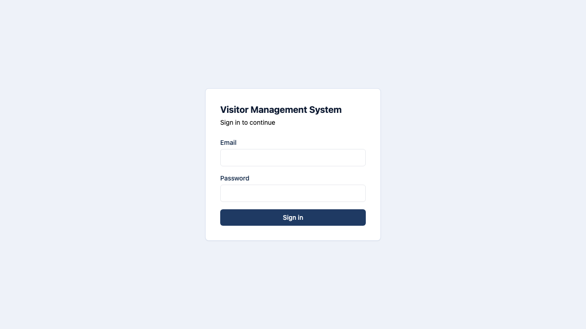 Login                                     | 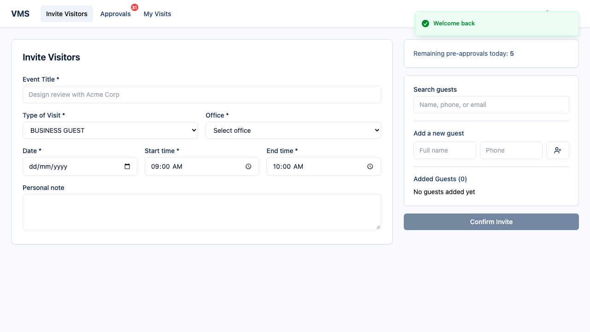 Host — Invite Visitors          |
| 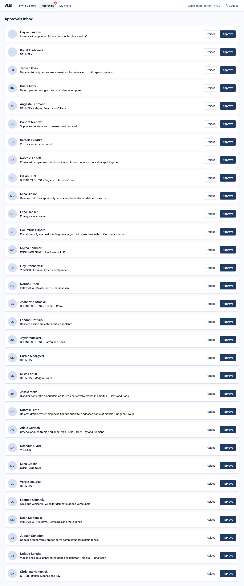 Host — Approvals Inbox       | 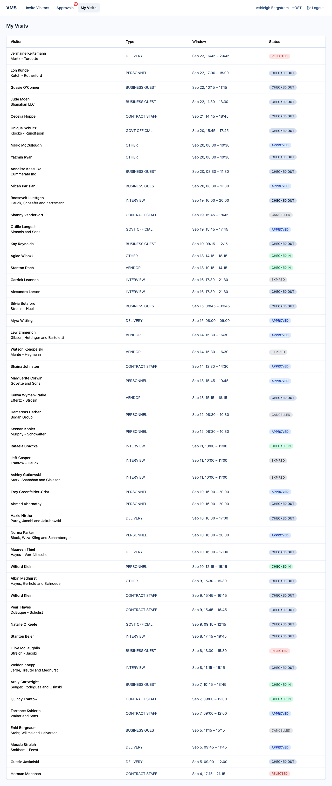 Host — My Visits                       |
| 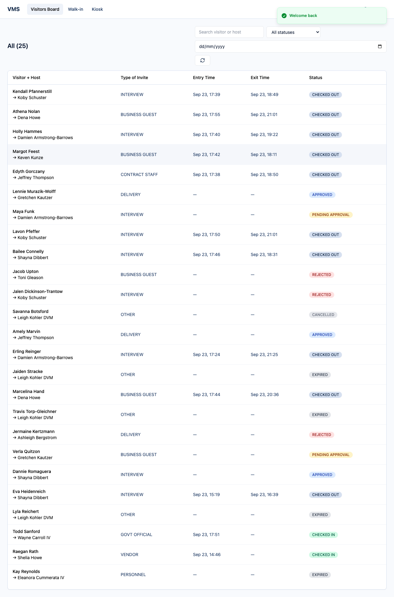 Front Desk — Visitors Board          | 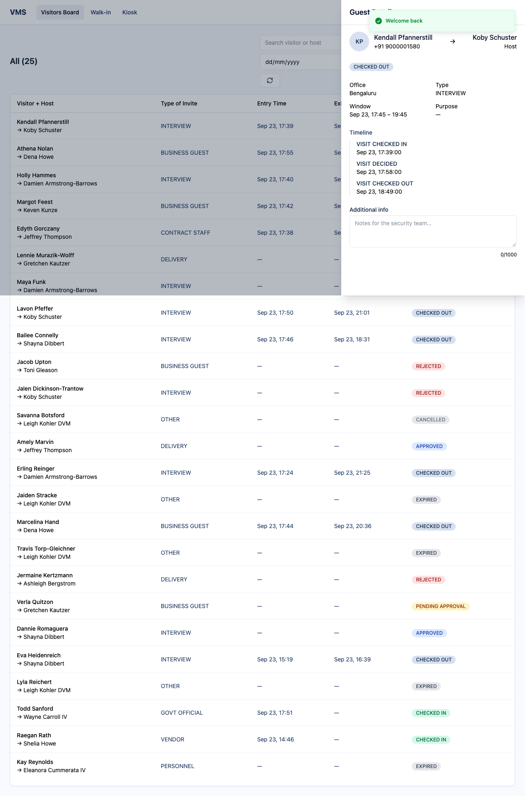 Front Desk — Guest Details |
| 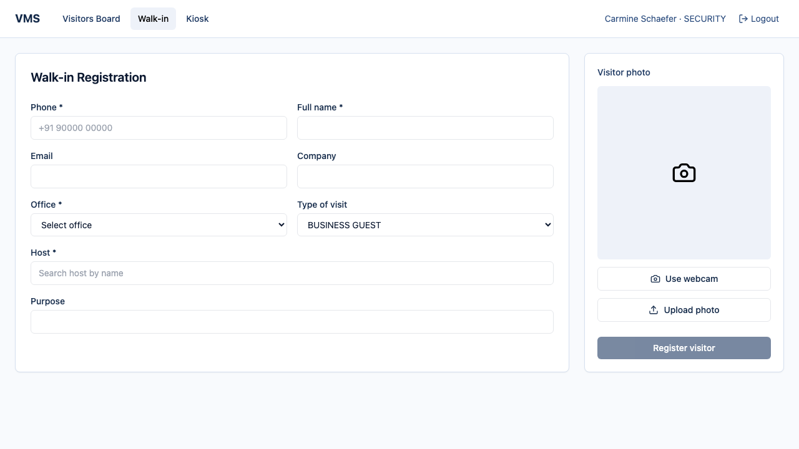 Front Desk — Walk-in Registration |  Kiosk — QR Check-in                             |
| 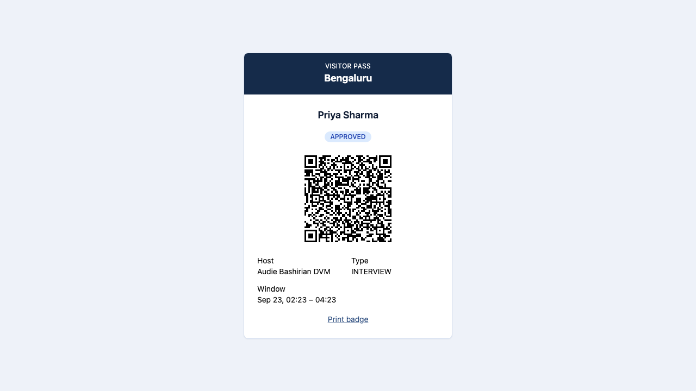 Visitor E-Pass                   | 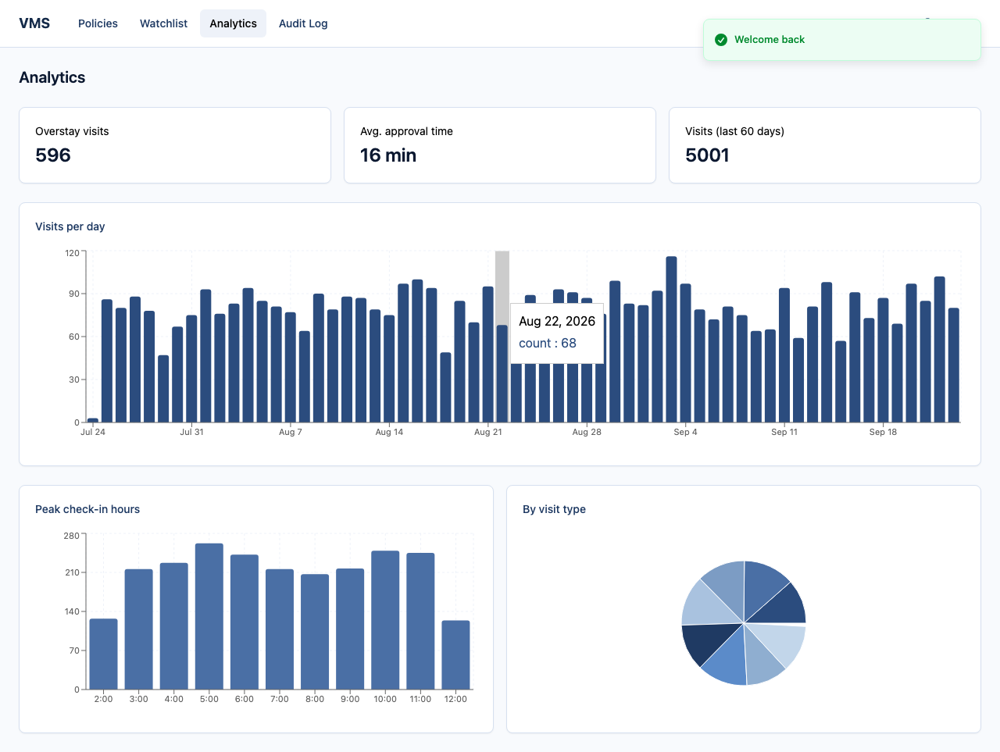 Admin — Analytics                 |
| 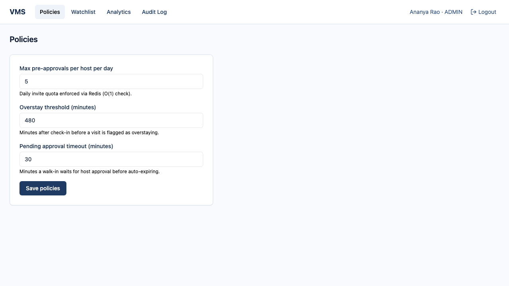 Admin — Policies              | 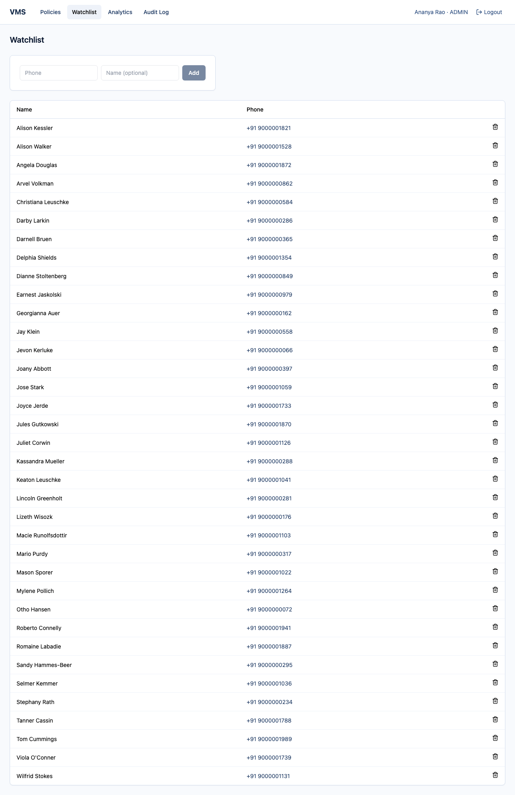 Admin — Watchlist                 |
| 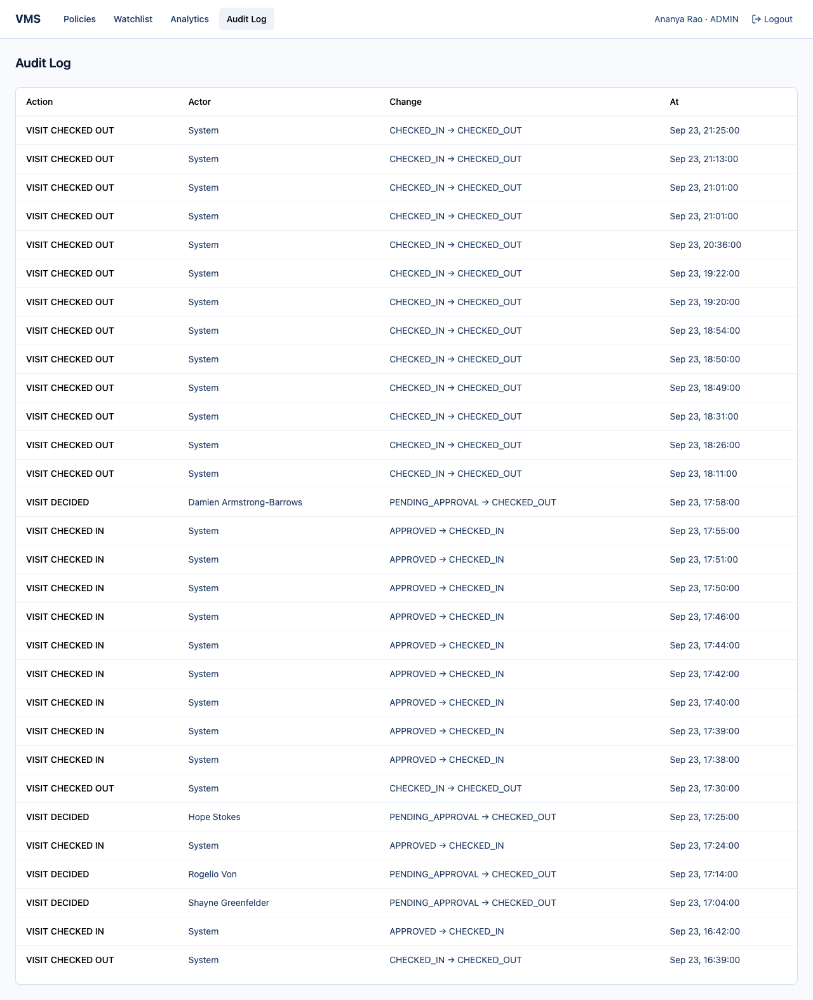 Admin — Audit Log               |                                                                                         |

Captured with Playwright against the live app + seeded data (`apps/web/e2e/screenshots.spec.ts`).

## Repo layout

```
apps/
  api/           # Express + Prisma + BullMQ worker
    src/         # routes -> controllers -> services -> repositories, domain/, jobs/, realtime/
    prisma/      # schema, migrations (incl. pg_trgm), seed script
    tests/       # Vitest + Supertest
  web/           # React + Vite
    src/         # pages/, components/, lib/, hooks/, auth/
    e2e/         # Playwright specs (incl. screenshot capture)
packages/
  shared/        # Zod schemas, enums, the visit-transition table — shared by api and web
docker-compose.yml
k6/              # load tests
docs/            # performance.md, decisions.md, demo-script.md, screenshots/
```

## Scripts

- `pnpm dev` — run api + web in watch mode
- `pnpm build` — build `packages/shared` then all apps
- `pnpm -r run lint` / `pnpm -r run typecheck` / `pnpm -r run test` — across every workspace
- `pnpm --filter=@vms/api run worker:dev` — run the BullMQ worker locally
- `pnpm --filter=@vms/api run db:migrate` — create/apply a Prisma migration (interactive)
- `pnpm --filter=@vms/api run db:studio` — browse the database in Prisma Studio
- `pnpm --filter=@vms/web run e2e` — Playwright E2E (needs the full stack running)
- `k6 run k6/<script>.js` — load tests (needs `k6` installed)
