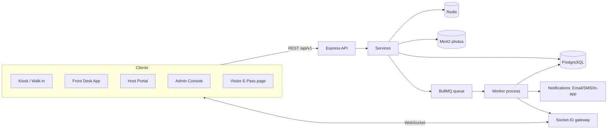
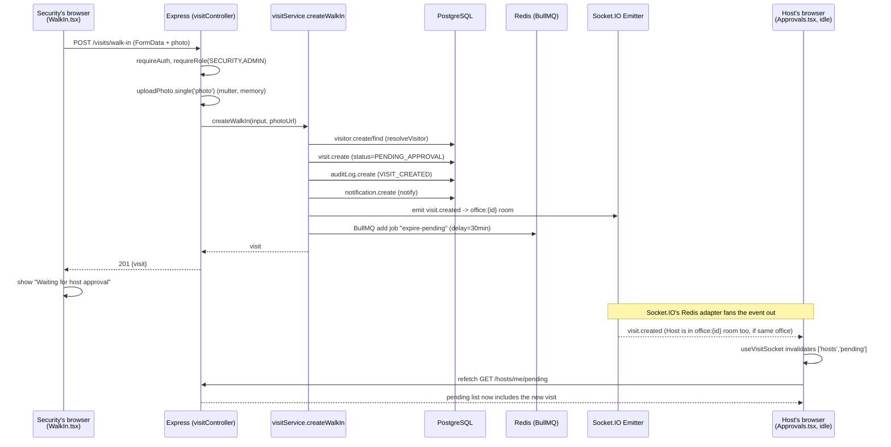

# VMS Learning Guide

Personal study notes for explaining/defending this project in an interview. One module per
section, built by walking through the _real_ code (file paths and line numbers are accurate as
of the commit this was written against — re-check line numbers if the code has moved).

---

## Module 0 — The Big Picture

### What the app does

A **Visitor Management System**. Four kinds of people use it:

1. **Visitor** — no login. Gets a QR e-pass by link (`/pass/:token`) or walks in and gets
   photographed at the desk.
2. **Host** (`HOST`) — an employee. Pre-approves visitors (creates invites) or approves/rejects
   walk-ins someone else registered for them.
3. **Security** (`SECURITY`) — front-desk staff. Registers walk-ins, watches the live board,
   checks people in/out, runs the kiosk.
4. **Admin** (`ADMIN`) — sets policies (daily invite quota, overstay threshold), manages the
   watchlist, views analytics and the audit log.

### System diagram

Two Node processes run the same codebase: `apps/api/src/server.ts` (HTTP API + Socket.IO
gateway) and `apps/api/src/worker.ts` (BullMQ job consumer) — they share `src/services`,
`src/lib`, `src/domain`.

### Tech stack — what and why

| Layer                        | Choice (version)                           | Why _this_, not the obvious alternative                                                                         |
| ---------------------------- | ------------------------------------------ | --------------------------------------------------------------------------------------------------------------- |
| Backend framework            | Express 4.21                               | Unopinionated, well known, no framework magic to explain                                                        |
| Language                     | TypeScript 5.6, `strict: true`             | Catches null/undefined bugs at compile time                                                                     |
| ORM                          | Prisma 6.19                                | Type-safe query results, migrations as readable SQL                                                             |
| Database                     | PostgreSQL 16                              | Relational data + real transactions (status change + audit row commit together or not at all)                   |
| Cache/counters/queue backend | Redis (`ioredis` 6)                        | Sub-ms `INCR`; also the transport BullMQ and the Socket.IO adapter both need — one moving part instead of three |
| Job queue                    | BullMQ 6.3                                 | Delayed jobs without a cron script polling a table every minute                                                 |
| Real-time                    | Socket.IO 4.8 + `@socket.io/redis-adapter` | WebSocket fallback to polling; Redis adapter lets the worker process (no HTTP server) push events too           |
| Frontend framework           | React 18                                   | Same reasoning as Express                                                                                       |
| Server-state cache           | TanStack Query                             | Gives `invalidateQueries` — the mechanism live updates lean on                                                  |
| Forms                        | React Hook Form + Zod                      | Zod schema shared between frontend and backend validation (`packages/shared/src/schemas.ts`)                    |
| Object storage               | MinIO                                      | S3-compatible; code doesn't change pointing at real AWS S3 later                                                |

### Roles → route guard

`apps/web/src/App.tsx:36-52` wraps route groups in `<ProtectedRoute roles={[...]}>` — a UX
nicety. The **real** enforcement is server-side: every route in
`apps/api/src/routes/visits.routes.ts:9-45` chains `requireRole(...)` before the controller runs.
A Host guessing a Security URL still can't call the API.

### Full request trace: Security registers a walk-in

Chosen because it's the one action that touches every layer: React → API → DB → Redis/queue →
Socket.IO → UI, on two different screens for two different people at once.

Step by step, with real line numbers:

1. **Click, in the browser.** `apps/web/src/pages/desk/WalkIn.tsx:119-149` — the `submit`
   mutation builds a `FormData` (not JSON — there's a photo file) and calls
   `apiFetch('/visits/walk-in', { method: 'POST', body: form, isForm: true })`.
2. **The fetch wrapper.** `apps/web/src/lib/api.ts:47-68` — attaches
   `Authorization: Bearer <token>` from an in-memory store (line 51), skips `JSON.stringify` when
   `isForm` is true (lines 55-56, so the browser sets the multipart boundary itself), always sends
   `credentials: 'include'` (line 67) so the httpOnly refresh cookie rides along.
3. **Route middleware chain.** `apps/api/src/routes/visits.routes.ts:9-15` — `requireAuth` →
   `requireRole('SECURITY','ADMIN')` → `uploadPhoto.single('photo')` (multer parses multipart
   into `req.file` + `req.body`) → `asyncHandler(visitController.createWalkIn)`.
4. **Controller.** `apps/api/src/controllers/visitController.ts:10-31` — `rawBody.visitor`
   arrives as a JSON _string_ (multipart can't nest objects), gets `JSON.parse`'d (lines 15-21),
   the whole body validated by `walkInSchema.parse(rawBody)` (line 22, a Zod schema shared with
   the frontend). Photo uploads to MinIO (line 26) _before_ the service is called.
5. **Service.** `apps/api/src/services/visitService.ts:15-54`:
   - `resolveVisitor` + `assertNotWatchlisted` (19-20) — dedup by phone, reject if blocked
   - `visitRepository.create(...)` (25) — one `INSERT`, status defaults `PENDING_APPROVAL`
   - `prisma.auditLog.create(...)` (35) — separate write powering the Guest Details timeline
   - `notify(...)` (47) — DB row + email/SMS/in-app + socket to `user:{hostId}`
   - `broadcastVisitEvent(VISIT_CREATED, officeId, ...)` (48) — push to `office:{id}` room
   - `schedulePendingExpiry(visit.id, timeoutMinutes)` (51) — `jobs/queue.ts:24-30` adds a
     BullMQ job into Redis, delay = timeout in ms. Nothing polls a table.
6. **Response + two UIs update.** Security gets `201 {visit}`, shows "waiting". Separately, the
   Host's browser — already joined to `office:{officeId}` on socket connect
   (`realtime/io.ts:38-44`) — receives `visit.created`, and
   `apps/web/src/hooks/useVisitSocket.ts:15-19` invalidates `['hosts','pending']`, silently
   refetching `Approvals.tsx`. No polling (though `refetchInterval: 15_000` on line 33 is a
   safety net if a socket event is ever missed).

### Why this architecture, not simpler ones

- **Separate worker vs `setTimeout` in the API** — a `setTimeout` dies on process restart
  (deploys happen constantly); a BullMQ job lives in Redis, survives restarts.
- **Socket.IO + Redis adapter vs polling** — polling scales badly (every tab = a request every
  N seconds, forever) and isn't actually live. Trade-off: more moving parts (pub/sub channel,
  stateful connections).
- **`notify()` writes DB + socket + email/SMS, not just one channel** — different purposes: DB
  row is durable (check later), socket is for someone watching now, email/SMS for someone not in
  the app at all.

### 5 interview questions

**Q1: Walk me through click-to-host-sees-it, no file names.**
Form submits multipart to `POST /visits/walk-in`. Middleware checks auth/role, multer parses the
photo, controller validates the JSON-encoded visitor field with Zod, service creates
visitor+visit rows, writes an audit entry, then in parallel: persists+sends a notification, emits
a Socket.IO event to the office room, and schedules a BullMQ auto-expiry job. Host's browser,
already in that office's room, gets the event and TanStack Query refetches — no polling.

**Q2: Why upload the photo to MinIO in the controller, not the service?**
Separation of concerns — the service shouldn't know about multer/MinIO, just takes
`photoUrl: string | null`. Makes the service trivially unit-testable without mocking storage.

**Q3: What if Redis is down when a walk-in is registered?**
`schedulePendingExpiry` is awaited after the visit is already committed to Postgres. If that
Redis call throws, the whole request 500s even though the visit row was created — a real gap,
not defended against today.

**Q4: How does the server know who's in which Socket.IO room?**
On connect (`realtime/io.ts:38-44`), same JWT as REST is decoded, socket joins
`user:{own id}` always and `office:{officeId}` if set. `io.to(room).emit(...)` fans out to
everyone currently joined.

**Q5: Why JSON.stringify the `visitor` field instead of real JSON for the whole request?**
Multipart also carries a binary file (the photo); multipart fields are flat strings, so a nested
object has to be serialized and parsed back server-side (`visitController.ts:14-21`).

### Hands-on exercise done

Added a temporary `console.log` after `broadcastVisitEvent` in `createWalkIn` to see the
visit id and office room printed on a real walk-in registration, then removed it.
